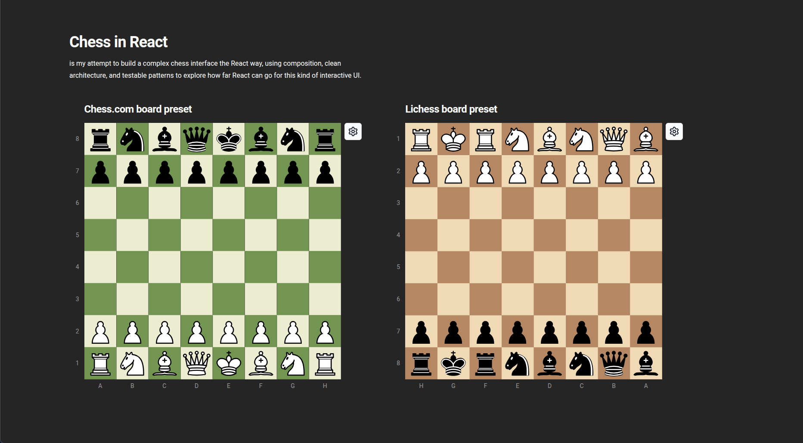

# Chess in React

Clean and reusable chess game implementation in React, built with best practices, a clear architecture, and a maintainable approach.

> Early development — currently being built and tested. Documentation will come later.

## TODO

- [x] Reusable UI component structure
- [x] Implement classic chess game logic
- [x] Clean architecture
- [x] Handle board rotation
- [x] Handle piece promotion
- [ ] Setup service layer to support all variants
  - [x] Setup service layer
  - [ ] Implement variants
- [ ] Write tests for game logic (once service layer is stable)
- [x] Migrate state management to Zustand for optimization
- [ ] Handle server communication
- [x] Create more board presets
- [ ] Write article to present the project and its architecture
- [ ] Add history system to allow undoing moves and viewing past game states
- [ ] Import and export to PGN format for game analysis and sharing
- [ ] Implement AI opponent using a chess engine like Stockfish for single-player mode
- [ ] Setup monorepo structure to support documentation and package 